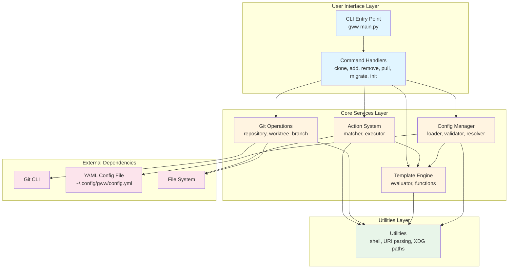

# Git worktree wrapper with additional fuctions
Name of console command is gww

## High-Level Architecture



### Component Descriptions

**CLI Layer** (`src/gww/cli/`)
- **main.py**: Entry point, argument parsing, command routing
- **commands/**: Individual command implementations (clone, add, remove, pull, migrate, init)

**Config Layer** (`src/gww/config/`)
- **loader.py**: YAML config file loading/saving using ruamel.yaml
- **validator.py**: Config structure validation
- **resolver.py**: Path resolution based on URI conditions and templates

**Template Layer** (`src/gww/template/`)
- **evaluator.py**: Template evaluation engine using simpleeval with strict type checking
- **functions.py**: Template function registry (URI, branch, tag, utility, project-specific functions)

**Git Layer** (`src/gww/git/`)
- **repository.py**: Git repository operations (clone, pull, status checks)
- **worktree.py**: Git worktree management (add, remove, list)
- **branch.py**: Branch operations and normalization

**Actions Layer** (`src/gww/actions/`)
- **matcher.py**: Match project rules based on `when` conditions
- **executor.py**: Execute actions (abs_copy, rel_copy, command)

**Utils Layer** (`src/gww/utils/`)
- **shell.py**: Shell completion generation
- **uri.py**: URI parsing and manipulation
- **xdg.py**: XDG config directory resolution

### Data Flow

1. **Clone Flow**: `CLI` → `clone` command → `ConfigMgr` resolves path → `TemplateEngine` evaluates template → `GitOps` clones repo → `ActionSys` matches and executes `after_clone` actions

2. **Add Worktree Flow**: `CLI` → `add` command → `ConfigMgr` resolves worktree path → `TemplateEngine` evaluates template → `GitOps` creates worktree → `ActionSys` matches and executes `after_add` actions

3. **Config Resolution**: `ConfigMgr` loads YAML → evaluates `when` conditions using `TemplateEngine` → selects matching source rule → evaluates path templates → returns resolved paths

# Configuration
Works with configuration file gww.yml located in $XDG_CONFIG_HOME compliant manner

## Config example
```yml
default_sources: ~/Developer/sources/default/path(-2)/path(-1)
default_worktrees: ~/Developer/worktrees/default/path(-2)/path(-1)/norm_branch()
# where:
# default_sources - template used to get checkout folder if no bellow sources conditions matched
# default_worktrees - template used to get worktree folder if no bellow sources conditions matched
# path(0) - first uri path segment
# path(1) - second and so on path segment. If segment with index is missing returns ""
# path(-1) - last path segment
# path(-2) - segment before last
# norm_branch() - normalized git branch with "/" replaced with "-"
sources:
    github:
        when: "github" in host # host if host part of uri, e.g "http://rulez.netbird.selfhosted:3000/vadimvolk/ansible.git" -> rulez.netbird.selfhosted
        sources: ~/Developer/sources/github/path(-2)/path(-1)
        worktrees: ~/Developer/worktrees/github/path(-2)/path(-1)/branch()
    gitlab:
        when: "gitlab" in host and !contains(host, "scp") # !contains mean not contains
        sources: ~/Developer/sources/gitlab/path(-3)/path(-2)/path(-1)
        worktrees: ~/Developer/worktrees/gitlab/path(-3)/path(-2)/path(-1)-branch()
    my_sources:
        when: path(0) == "username"
        sources: ~/Developer/sources/mine/path(-2)/path(-1)
        worktrees: ~/Developer/worktrees/mine/path(-2)/path(-1)/norm_branch("-")
# where:
# sources - condition based checkout and worktrees locations
# github, gitlab, my_sources - names of locations sections
# Each section should contain 'when'. If evaluated to true that section used for getting settings. 
# sources - optional value, if missing default_sources used, if present evalueate to get checkout folder
# worktrees - optional value, if missing default_worktrees used, if present evaluate to get worktrees folder
# branch() - git branch name as is
actions:
    - when: file_exists(local.properties)
      after_clone: 
        - abs_copy("~/sources/default-local.properties", "local.properties")
      after_add:
        - rel_copy("local.properties")
        - command("custom-handler")
    
# where:
# android - project type name, if 'when' condition evaluates to true after_clone executed after checkout, and after_add executed when worktree added
# abs_copy - copy file from absolute path (first argument), to filename relative to checkout or worktree base folder
# rel_copy - copy file with relative path from source to worktree, this action applicable only to worktree actions
# command(custom_handler) - if executed for source receives a single argument a source folder, if executed for worktree receive 2 arguments source folder and worktree folder
```

# Commands:
gww clone <uri> - find proper location for new source and checkout there. Then analyze result with actions and execute after_clone for any action with matched 'when' condition

gww add <branch> - must executed inside a source or worktree folder. Add a worktree for branch. To get destination folder uses settings file

gww remove <branch|worktree folder> [--force] - remove worktree folder by branch name or folder location. If force specified ignore that worktree is not clean, otherwise show error for not clean worktrees

gww pull - check that sources has main / master branch checkout, it's clean and if it is execute git pull. Can be executed from source or worktree folder. If executed from inside worktree folder will update source folder

gww migrate <old-repos> [--dry-run] [--move] - scan old-repos folder, check it against current config and if location is incorrent copy (default) or move (if --move specified) to new position

gww init config - create default settings file, gww.yml in $XDG_CONFIG_HOME compliant location. Came up with simple config with default_sources and default_worktrees filled and large comment block with examples covering other cases and function with documentation. 

gww init shell [fishshell|zsh|bash] generate autocompletion for specific shell. Should be able to complete params including local and remote branches, worktree folders and other params like: --force, --dry-run and so on

# Common technical solutions:
## Use uv for dependencies management and installing gww script in target system
## Use type hints for all function arguments and return values
## Use simpleeval library for 'when' conditions and templates evaluation
## Customize simpleeval for strict check of function argument count and it's types. Show readable error message if failed
## For template evaluation pre process string for following tokens: function calls, otheres. Evaluate function calls and join with rest of text. if "(" is part of template and not a fuction call it should be duplicated. Eg template "not_function((my folder))" should evaluated to "not_function(my folder)". Do not bother with nested fuctions for that case.
