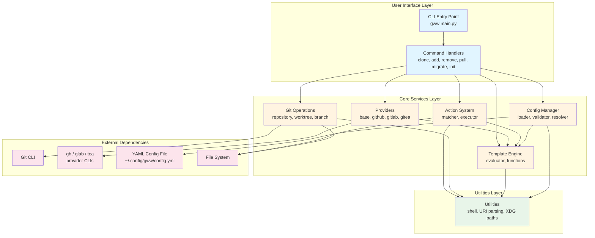

# Git worktree wrapper with additional fuctions
Name of console command is gww

## High-Level Architecture


```mermaid
graph TB
    subgraph "User Interface Layer"
        CLI[CLI Entry Point<br/>gww main.py]
        Commands[Command Handlers<br/>clone, add, remove, pull, migrate, init]
    end

    subgraph "Core Services Layer"
        ConfigMgr[Config Manager<br/>loader, validator, resolver]
        TemplateEngine[Template Engine<br/>evaluator, functions]
        GitOps[Git Operations<br/>repository, worktree, branch]
        ActionSys[Action System<br/>matcher, executor]
        Providers[Providers<br/>base, github, gitlab, gitea]
    end

    subgraph "Utilities Layer"
        Utils[Utilities<br/>shell, URI parsing, XDG paths]
    end

    subgraph "External Dependencies"
        Git[Git CLI]
        GitHubCLI[gh / glab / tea<br/>provider CLIs]
        ConfigFile[YAML Config File<br/>~/.config/gww/config.yml]
        FileSystem[File System]
    end

    CLI --> Commands
    Commands --> ConfigMgr
    Commands --> GitOps
    Commands --> ActionSys
    Commands --> Providers

    ConfigMgr --> TemplateEngine
    ConfigMgr --> ConfigFile
    ConfigMgr --> Utils

    TemplateEngine --> Utils

    GitOps --> Git
    GitOps --> FileSystem
    GitOps --> Utils

    ActionSys --> TemplateEngine
    ActionSys --> FileSystem
    ActionSys --> Utils

    Providers --> TemplateEngine
    Providers --> GitHubCLI

    Commands --> TemplateEngine

    style CLI fill:#e1f5ff
    style Commands fill:#e1f5ff
    style ConfigMgr fill:#fff4e1
    style TemplateEngine fill:#fff4e1
    style GitOps fill:#fff4e1
    style ActionSys fill:#fff4e1
    style Providers fill:#fff4e1
    style Utils fill:#e8f5e9
    style Git fill:#fce4ec
    style GitHubCLI fill:#fce4ec
    style ConfigFile fill:#fce4ec
    style FileSystem fill:#fce4ec
```

### Component Descriptions

**CLI Layer** (`src/gww/cli/`)
- **main.py**: Entry point, argument parsing, command routing
- **commands/**: Individual command implementations (clone, add, remove, pull, clean, migrate, init)

**Config Layer** (`src/gww/config/`)
- **loader.py**: YAML config file loading/saving using ruamel.yaml
- **validator.py**: Config structure validation (`providers:` block lives here too — ADR-0019)
- **resolver.py**: Path resolution based on URI conditions and templates

**Template Layer** (`src/gww/template/`)
- **evaluator.py**: Template evaluation engine using simpleeval with strict type checking
- **functions.py**: Template function registry (URI, branch, tag, utility, project-specific functions)

**Git Layer** (`src/gww/git/`)
- **repository.py**: Git repository operations (clone, pull, status checks)
- **worktree.py**: Git worktree management (add, remove, list)
- **branch.py**: Branch operations and normalization

**Actions Layer** (`src/gww/actions/`)
- **matcher.py**: Match project rules based on `when` conditions
- **executor.py**: Execute actions (abs_copy, rel_copy, command)

**Providers Layer** (`src/gww/providers/`)
- **base.py**: `Provider` dataclass + host-pattern matching primitive (ADR-0019)
- **github.py / gitlab.py / gitea.py**: Reference defaults — **NOT auto-applied**; users copy the relevant fields into their config
- The `clean` command resolves the source's origin host against user-declared `providers.<kind>.host_patterns` in config order; first match wins. No env override, no built-in defaults for hosted instances.

**Utils Layer** (`src/gww/utils/`)
- **shell.py**: Shell completion generation
- **uri.py**: URI parsing and manipulation
- **xdg.py**: XDG config directory resolution

### Data Flow

1. **Clone Flow**: `CLI` → `clone` command → `ConfigMgr` resolves path → `TemplateEngine` evaluates template → `GitOps` clones repo → `ActionSys` matches, executes, and reports `after_clone` actions (per-rule criticality, grouped summary on stderr)

2. **Add Worktree Flow**: `CLI` → `add` command → `ConfigMgr` resolves worktree path → `TemplateEngine` evaluates template → `GitOps` creates worktree → `ActionSys` matches, executes, and reports `after_add` actions (per-rule criticality, grouped summary on stderr)

3. **Remove Worktree Flow** (ADR-0011): `CLI` → `remove` command → `ConfigMgr` loads config → `GitOps` resolves worktree by branch or path → `TemplateEngine` builds context (`source_path`/`dest_path`/`branch`/`tags`) → `ActionSys` matches, executes, and reports `before_remove` actions → critical failures abort; otherwise `GitOps` runs `git worktree remove`

4. **Clean Flow** (ADR-0015 / ADR-0018 / ADR-0019): `CLI` → `clean` command → `ConfigMgr` loads config (incl. `providers:` block) → `GitOps` lists worktrees, filters out main checkout and default branch → for each surviving worktree, `Providers` resolve a provider via host-pattern match (or fall back to `git branch --merged <default>`) → `TemplateEngine` renders the per-branch `merged` template → subprocess runs the rendered command, **exit-code-only**; streams pass through to the user → after batch confirmation, `ActionSys` runs `before_remove`, then `GitOps` runs `git worktree remove` and `git branch -d`

5. **Config Resolution**: `ConfigMgr` loads YAML → evaluates `when` conditions using `TemplateEngine` → selects matching source rule → evaluates path templates → returns resolved paths

# Configuration
Works with configuration file gww.yml located in $XDG_CONFIG_HOME compliant manner

## Config example
```yml
default_sources: ~/Developer/sources/default/path(-2)/path(-1)
default_worktrees: ~/Developer/worktrees/default/path(-2)/path(-1)/norm_branch()
# where:
# default_sources - template used to get checkout folder if no bellow sources conditions matched
# default_worktrees - template used to get worktree folder if no bellow sources conditions matched
# path(0) - first uri path segment
# path(1) - second and so on path segment. If segment with index is missing returns ""
# path(-1) - last path segment
# path(-2) - segment before last
# norm_branch() - normalized git branch with "/" replaced with "-"
sources:
    github:
        when: "github" in host # host if host part of uri, e.g "http://rulez.netbird.selfhosted:3000/vadimvolk/ansible.git" -> rulez.netbird.selfhosted
        sources: ~/Developer/sources/github/path(-2)/path(-1)
        worktrees: ~/Developer/worktrees/github/path(-2)/path(-1)/branch()
    gitlab:
        when: "gitlab" in host and !contains(host, "scp") # !contains mean not contains
        sources: ~/Developer/sources/gitlab/path(-3)/path(-2)/path(-1)
        worktrees: ~/Developer/worktrees/gitlab/path(-3)/path(-2)/path(-1)-branch()
    my_sources:
        when: path(0) == "username"
        sources: ~/Developer/sources/mine/path(-2)/path(-1)
        worktrees: ~/Developer/worktrees/mine/path(-2)/path(-1)/norm_branch("-")
# where:
# sources - condition based checkout and worktrees locations
# github, gitlab, my_sources - names of locations sections
# Each section should contain 'when'. If evaluated to true that section used for getting settings. 
# sources - optional value, if missing default_sources used, if present evalueate to get checkout folder
# worktrees - optional value, if missing default_worktrees used, if present evaluate to get worktrees folder
# branch() - git branch name as is
actions:
    - when: file_exists(local.properties)
      after_clone:
        - abs_copy("~/sources/default-local.properties", "local.properties")
      after_add:
        - rel_copy("local.properties")
        - command("custom-handler")
    - when: tag("archive") == "true"
      before_remove:
        - command("tar -czf ~/archives/norm_branch()-time_id('%Y%m%d').tar.gz dest_path()")

# where:
# android - project type name, if 'when' condition evaluates to true after_clone executed after checkout, and after_add executed when worktree added
# abs_copy - copy file with absolute path (first argument), to filename relative to checkout or worktree base folder
# rel_copy - copy file with relative path from source to worktree, this action applicable only to worktree actions
# command(custom_handler) - if executed for source receives a single argument a source folder, if executed for worktree receive 2 arguments source folder and worktree folder
# before_remove - actions run before gww remove deletes the worktree; dest_path() is the worktree, source_path() is its parent repo, branch() is the checked-out branch (or "" on detached HEAD). Critical failures abort the remove and exit 1.
#
# Providers (consumed by `gww clean`, ADR-0019)
# Optional. Without an entry, `--merged` falls back to `git branch --merged <default>`.
# Resolution: test the source's origin host against `host_patterns` in config order; first match wins.
# No env override; no built-in defaults. Reference starting points live in `src/gww/providers/`.
providers:
  github:
    host_patterns: ['^github\.com$']
    merged: 'gh pr list --head branch() --state merged'
  gitlab:
    host_patterns: ['^gitlab\.com$']
    merged: 'glab mr list --source-branch branch() --state merged'
  gitea:
    host_patterns: ['^codeberg\.org$']
    merged: 'tea pulls list --head branch() --state closed --output json | jq -e "[.[] | select(.merged)] | length > 0"'
```

# Commands:
gww clone <uri> - find proper location for new source and checkout there. Then analyze result with actions and execute after_clone for any action with matched 'when' condition

gww add <branch> - must executed inside a source or worktree folder. Add a worktree for branch. To get destination folder uses settings file

gww remove <branch|worktree folder> [--force] [--tag key=value]... - remove worktree folder by branch name or folder location. If force specified ignore that worktree is not clean, otherwise show error for not clean worktrees. `--tag` plumbs `key=value` into the action-loop context (visible to `tag()`/`tag_exist()` in `before_remove` rules). After resolving the worktree, `before_remove` actions from the project rules run against it; critical failures abort the remove and exit `1`, non-critical failures are reported but the remove still proceeds. `--force` is git-only and does not bypass `before_remove`.

gww pull - check that sources has main / master branch checkout, it's clean and if it is execute git pull. Can be executed from source or worktree folder. If executed from inside worktree folder will update source folder

gww clean [--merged|--all] [--dry-run] [--yes|-y] [--force] - remove worktrees (and their local branches) from the current source repository whose branch satisfies the active filter. `--merged` (default) removes merged-MR worktrees (provider query, falling back to `git branch --merged <default>` when no provider resolves); `--all` skips the MR filter. `--dry-run` runs the full flow with no side effects; `--yes` skips the batch confirmation prompt; `--force` passes `--force` to `git worktree remove` and uses `-D` for `git branch -d`. Remote branches are never touched. Provider interaction is exit-code-only via `gh`/`glab`/`tea` (ADR-0018). See `docs/handoff-gww-clean-v2.md` for the locked contract.

gww migrate <path>... [--dry-run] [--copy | --inplace] - scan path(s) for repos, merge and dedupe; copy (default) or inplace move (worktrees then sources, repair, clean empty folders) to new positions

gww init config - create default settings file, gww.yml in $XDG_CONFIG_HOME compliant location. Came up with simple config with default_sources and default_worktrees filled and large comment block with examples covering other cases and function with documentation. 

gww init shell [fishshell|zsh|bash] generate autocompletion for specific shell. Should be able to complete params including local and remote branches, worktree folders and other params like: --force, --dry-run and so on

# Common technical solutions:
## Use uv for dependencies management and installing gww script in target system
## Use type hints for all function arguments and return values
## Use simpleeval library for 'when' conditions and templates evaluation
## Customize simpleeval for strict check of function argument count and it's types. Show readable error message if failed
## For template evaluation pre process string for following tokens: function calls, otheres. Evaluate function calls and join with rest of text. if "(" is part of template and not a fuction call it should be duplicated. Eg template "not_function((my folder))" should evaluated to "not_function(my folder)". Do not bother with nested fuctions for that case.
